 

 

<table><tr>
<td width="190" align="center"></td>
<td>

**Founder. Researcher. Builder of machines that think and machines that move.**

I design AI systems that remember reliably and act predictably: LLM memory, multi-agent validation, retrieval, and embedded robotics. Final-year B.Tech in AI and Data Science at ADYPU, Pune. Founder of **StateJar** and **Grow On Media**.

</td>
</tr></table>

 

**[StateJar](https://statejar.com)** is a deterministic memory layer for multi-session conversational AI. Instead of replaying full chat history, it gives the model structured state handles.

| | |
|---|---|
| **Architecture** | 10-module deterministic state pipeline |
| **Efficiency** | 48.9% fewer context tokens per turn (benchmarked) |
| **Reliability** | 704 passing tests, append-only versioning, replayable audit logs |
| **Stack** | FastAPI, MySQL, React, Railway, Vercel |
| **Patent** | Indian application 202621017626, published April 2026 |

 

| Year | Honour | Role |
|---|---|---|
| 2026 | 🏆 **First Prize**, Hack4Humanity (AI for Good), BRAIN Foundation, IEEE Pune Section, IEEE SIGHT | Team lead |
| 2026 | 🏆 **Winner**, Smart India Hackathon, internal round | Team lead |
| 2025 | 🏆 **Winner**, National Level Ideathon, Keystone School of Engineering | Team lead |
| 2025 | 🏆 **Winner**, Smart India Hackathon, internal round | Team member |

 

- 📘 *Intelligent Analytics for Environmental Sustainability and Energy Optimization*, CRC Press (Taylor & Francis), 2026
- 📄 *The Impact of AI in the Indian Economy*, Progress in Economics Research, Nova Publications, 2025
- 📗 *Aquabot: Smart River Clean-up with AI and Solar Tech*, Notion Press, 2025
- 📜 **Patent**: StateJar deterministic memory layer, Indian application 202621017626, 2026

 

| Project | What it does | Stack |
|---|---|---|
| ⚖️ **The Jury** | Proposer, Critic and Judge agents debate to cut hallucinations, with live cost auditing | FastAPI, LangGraph, MySQL |
| 🧠 **Brain Tumor MRI Classifier** | ResNet-18 fine-tuned on four-class MRI with class-imbalance handling | PyTorch, Gradio |
| 🌾 **DhartiQ** | Multilingual voice and text RAG advisor for marginal farmers | Python, LLM, RAG |
| ⚙️ **Predictive Maintenance** | Real-time failure-probability dashboard on IoT sensor data | R, Shiny, ESP32 |
| ✉️ **Email Deliverability API** | SPF, DKIM and DMARC analysis with a weighted risk model | PHP, DNS |
| 📚 **Textbook of Tomorrow** | Browser extension that turns LMS content into explanations and quizzes | JavaScript, LLM |
| 🤖 **Robotics and IoT** | Obstacle-avoiding ESP32 vehicle, smart blind stick, fire and smoke detection | ESP32, Pi Pico |

 

**Languages** 

**AI and ML** 
 
LangChain · LangGraph · RAG · Qdrant

**Backend and Infra** 
 
Railway

**Embedded and Robotics** 
 
ESP32 · Arduino · Raspberry Pi Pico

 

<picture>
  <source media="(prefers-color-scheme: dark)" srcset="https://raw.githubusercontent.com/KING-OF-FLAME/KING-OF-FLAME/output/snake-dark.svg"/>
  
</picture>

 

Open to research collaborations, robotics builds and AI engineering roles.

**[linkedin.com/in/yash-developer](https://linkedin.com/in/yash-developer)** &nbsp;·&nbsp; **[mr.yashraj5233@gmail.com](mailto:mr.yashraj5233@gmail.com)** &nbsp;·&nbsp; **[statejar.com](https://statejar.com)**
