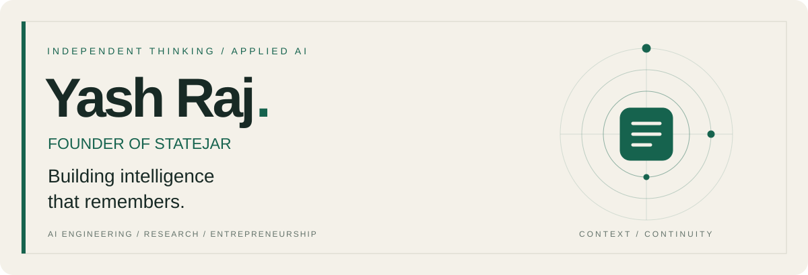

  

  <a href="https://statejar.com"><b>STATEJAR</b></a> &nbsp; / &nbsp;
  <a href="https://www.linkedin.com/in/yash-developer/"><b>LINKEDIN</b></a> &nbsp; / &nbsp;
  <a href="https://iamyashraj.com"><b>PORTFOLIO</b></a> &nbsp; / &nbsp;
  <a href="mailto:mr.yashraj5233@gmail.com"><b>EMAIL</b></a>

 

<table>
<tr>
<td width="74%" valign="top">
<h2>AI engineer. Researcher. Founder.</h2>

I'm <b>Yash Raj</b>, founder of <a href="https://statejar.com"><b>StateJar</b></a>. I build AI systems with a focus on persistent memory, agent orchestration, and the infrastructure that turns an idea into a usable product.

My work connects research with implementation: conversational memory, multi-agent reasoning, developer APIs, and practical automation.

<b>B.Tech · Artificial Intelligence &amp; Data Science</b> Ajeenkya DY Patil University · India

</td>
<td width="26%" align="center" valign="middle">

 YASH RAJ / KING-OF-FLAME
</td>
</tr>
</table>

## 01 / The flagship

### StateJar — memory infrastructure for AI

**An AI application should be able to carry useful context beyond a single conversation.**

I'm building StateJar around that problem: persistent, structured memory for LLM applications, with an emphasis on context continuity and developer integration.

| Focus | What I'm building toward |
| :--- | :--- |
| Memory | Retaining and updating useful information across sessions |
| Control | Making stored context manageable and inspectable |
| Integration | Bringing memory into applications through APIs and SDKs |
| Trust | Treating privacy and access boundaries as engineering requirements |

**Python · FastAPI · SQLAlchemy · MySQL · React**

[Explore StateJar ↗](https://statejar.com)

## 02 / Selected recognition

| Year | Recognition | Contribution |
| :--- | :--- | :--- |
| **2026** | **1st Prize · Hack4Humanity** | Team lead · AI for Good track |
| **2026** | **Smart India Hackathon · Internal winner** | Team lead · institute-level selection |
| **2025** | **National-level Ideathon · 2nd runner-up** | Team lead · Keystone School of Engineering, Pune |
| **2025** | **Smart India Hackathon · Internal winner** | Institute-level recognition |

[Awards and background on LinkedIn ↗](https://www.linkedin.com/in/yash-developer/)

## 03 / Research & intellectual property

My research interests span **LLM memory, reliable AI systems, and applied intelligence**.

- **LLM memory architecture** — first inventor on a patent application published in India, April 2026.
- **Intelligent Analytics for Environmental Sustainability and Energy Optimization** — CRC Press, 2026.
- **The Impact of AI in the Indian Economy** — *Progress in Economics Research*, Nova Publications, 2025; co-author.
- **Aquabot: Smart River Clean-up With AI And Solar Tech Using Metal Nanotechnology** — Notion Press, 2025.

[Publication details ↗](https://www.linkedin.com/in/yash-developer/)

## 04 / Beyond the flagship

| Project | Engineering focus |
| :--- | :--- |
| **[The Jury: The AI Courtroom](https://github.com/KING-OF-FLAME/the-jury-ai-courtroom)** | Proposer–Critic–Judge workflows for examining LLM responses through adversarial debate, with persistent verdict history and cost auditing. |
| **[URL Metadata & Preview API](https://github.com/KING-OF-FLAME/url-metadata-api)** | OpenGraph extraction, SEO metadata, and URL preview tooling built for practical hosting constraints. |
| **[Email Deliverability Intelligence API](https://github.com/KING-OF-FLAME/email-deliverability-intelligence-api)** | Email-domain analysis using authentication records, infrastructure signals, and risk scoring. |
| **[Keyword Suggestions Tool](https://github.com/KING-OF-FLAME/keyword_suggestions_tool)** | Search-autocomplete aggregation to support content research and SEO workflows. |

## 05 / Engineering toolkit

| Layer | Technologies & methods |
| :--- | :--- |
| **AI systems** | LLM integration · multi-agent workflows · NLP · machine learning |
| **Backend & data** | Python · FastAPI · SQLAlchemy · MySQL · SQL · PHP |
| **Product interfaces** | React · JavaScript · HTML · CSS |
| **Applied intelligence** | TensorFlow · data analysis · visualization · IoT automation |
| **Hardware & workflow** | ESP32 · Arduino · Raspberry Pi · Git · GitHub |

<b>Earlier learning & certifications</b>

- Introduction to Data Science — 2024
- Programming using Java — 2024
- Arduino Based Automation — 2023
- DROP Certified Security Course — 2021
- Fundamentals of Information Security — 2021

## 06 / The founder perspective

Alongside StateJar, I'm the **Founder & CEO of Grow On Media**. Building a business has shaped how I approach engineering: understand the user's problem, make the system useful, and keep improving it after launch.

I'm interested in **AI engineering, research collaborations, and developer tools**—especially work involving memory, agents, and dependable AI applications.

**Have a problem worth building for? [Let's talk.](mailto:mr.yashraj5233@gmail.com)**

---

<b>YASH RAJ</b> &nbsp; · &nbsp; Research with purpose. Engineering with ownership.

